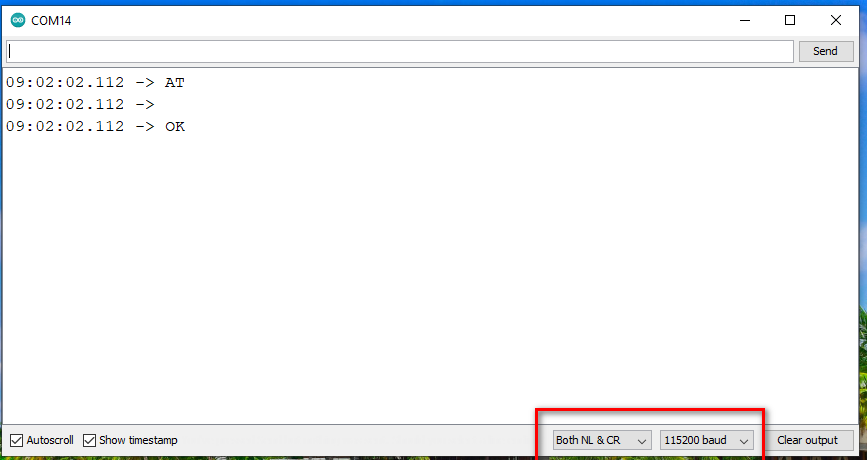
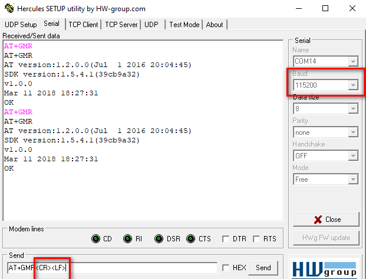
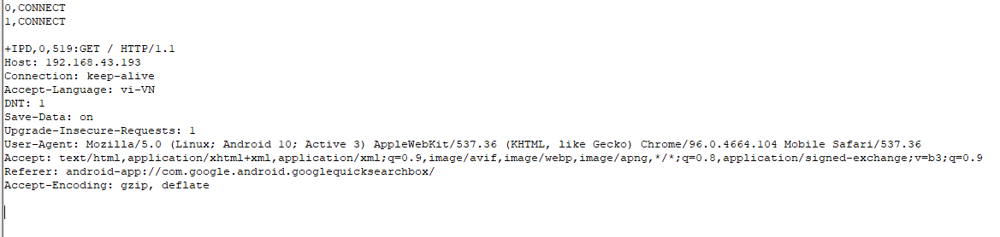

# UART control esp01-s with AT Commands 

## Bước 1: Kết nối phần cứng

Sơ đồ kết nối

| CP210x       		  | esp01-s |
|:-------------------:| --------:|
| 3v3   |     3v3    |
| gnd   |     gnd    |
| TX    |     RX    |
| RX    |     TX    |

## Bước 2: Set up app TX (COM Arduino or Hercules)





Chú ý: Tốc độ baud mặc định 115200, sau lệnh phải có CR LF

## Bước 3: Kiểm tra kết nối

Gửi lệnh từ monitor

```AT```

Nếu nhận phản hồi "OK" là module đang hoạt động nếu nhận "ERROR" hoặc không nhận được gì thì check kĩ lại bước 1, 2

## Bước 4: Basic AT Commands
The ESP8266 ESP-01 module has three operation modes:

Access Point (AP)
Station (STA)
Both
In AP the Wi-Fi module acts as a Wi-Fi network, or access point (hence the name), allowing other devices to connect to it. This does not mean that you will be able to check your Facebook from your device while the ESP-01 module is operating in the AP mode. It simply establishes a two way communication between the ESP8266 and the device that is connected to it via Wi-Fi.

In STA mode, the ESP-01 can connect to an AP such as the Wi-Fi network from your house. This allows any device connected to that network to communicate with the module.

The third mode of operation permits the module to act as both an AP and a STA.

## Bước 5: Basic AT Commands - STA Mode

In this tutorial, we are going to set the module to operate in STA mode by typing the following command:

```AT+CWMODE=1```

The corresponding number for each mode of operation is as follows:

STA = 1
AP = 2
Both = 3

## Bước 6: Check mode
```AT+CWMODE?```


## Bước 7: Kết nối mạng Wi-Fi
Khi chúng ta đã đưa ESP-01 vào chế độ STA, chúng ta cần kết nối với mạng Wi-Fi. Đầu tiên, chúng ta có thể kiểm tra xem module đã kết nối với mạng nào chưa bằng cách gửi lệnh:

```AT+CIFSR```

Lệnh này sẽ hiển thị địa chỉ IP của module ESP-01. Nếu bạn không nhận được địa chỉ IP sau khi nhập lệnh trên, sử dụng lệnh sau để kết nối với mạng của bạn:

```AT+CWJAP="Wi-FiNetwork","Password"```

Điền tên mạng Wi-Fi của bạn và mật khẩu để kết nối. Hãy chắc chắn rằng bạn bao gồm dấu ngoặc kép. Sau vài giây, bạn sẽ nhận được phản hồi "OK". Bạn có thể kiểm tra lại xem bạn đã có địa chỉ IP hay chưa bằng cách sử dụng lệnh:

```AT+CIFSR```

## Bước 8: Các lệnh AT cơ bản - Kích hoạt kết nối
Sau đó, chúng ta cần kích hoạt chế độ kết nối đa điểm trước khi cấu hình module ESP8266 ESP-01 như một máy chủ. Gõ lệnh sau:

```AT+CIPMUX=1```

Một lần nữa, mỗi số liên quan đến một loại kết nối:

Đơn lẻ = 0
Đa điểm = 1

Bước tiếp theo là khởi động máy chủ ở cổng 80:

```AT+CIPSERVER=1,80```

Số đầu tiên được sử dụng để chỉ định liệu chúng ta muốn đóng chế độ máy chủ (0) hay mở chế độ máy chủ (1). Số thứ hai chỉ định cổng mà client sử dụng để kết nối với máy chủ. Chúng ta chọn cổng 80 vì đây là cổng mặc định cho giao thức HTTP.

## Bước 9: Phản hồi
Bây giờ, khi chúng ta mở trình duyệt web và nhập địa chỉ IP của module ESP, chúng ta sẽ nhận được phản hồi như hình dưới



Đây là yêu cầu HTTP mà máy tính của chúng ta gửi đến máy chủ để lấy một tệp. Nó chứa một số thông tin thú vị như tệp bạn muốn truy xuất, tên và phiên bản của trình duyệt, hệ điều hành bạn đang sử dụng, ngôn ngữ bạn muốn nhận tệp và nhiều thông tin khác.

##Bước 10: Các lệnh AT cơ bản - Gửi và hiển thị dữ liệu
Chúng ta có thể sử dụng các lệnh sau để gửi một số dữ liệu và hiển thị nó trong cửa sổ trình duyệt web:


```AT+CIPSEND=0,5```

Số “0” chỉ ra kênh mà dữ liệu sẽ được truyền qua; còn “5” đại diện cho số ký tự sẽ được gửi.

Khi chúng ta nhấn Enter, ký hiệu “>” xuất hiện. Điều này cho biết rằng bây giờ chúng ta có thể nhập các ký tự mà chúng ta muốn gửi đến trình duyệt. Trong ví dụ này, chúng ta chọn “hello”.

Sau vài giây, chúng ta nhận được phản hồi "SEND OK." Điều này có nghĩa là dữ liệu đã được truyền thành công đến client. Tuy nhiên, không có gì xuất hiện trên cửa sổ trình duyệt web ngay lập tức. Điều này là do cần phải đóng kênh trước để hiển thị các ký tự. Chúng ta sử dụng lệnh sau để đóng kênh:

```AT+CIPCLOSE=0```

Số “0” chỉ ra kênh đang được đóng.